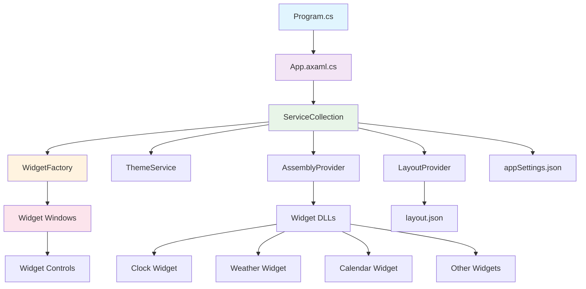
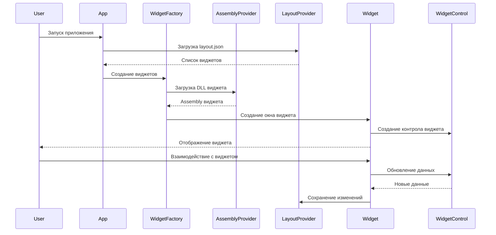

# uWidgets - Система виджетов для Windows

## 🎯 Что такое uWidgets?

**uWidgets** — это современная система виджетов для Windows, построенная на .NET 8 и Avalonia UI. Приложение позволяет создавать, настраивать и управлять интерактивными виджетами прямо на рабочем столе Windows с поддержкой прозрачности, темной темы и гибкой настройки.

### ✨ Основные возможности

- 🎨 **Современный дизайн** - Поддержка темной/светлой темы с настраиваемыми цветами
- 🔧 **Модульная архитектура** - Виджеты загружаются как отдельные DLL-модули
- 📱 **Адаптивность** - Виджеты автоматически масштабируются и выравниваются по сетке
- 🌍 **Многоязычность** - Поддержка множества языков интерфейса
- ⚡ **Высокая производительность** - Оптимизированная работа с минимальным потреблением ресурсов
- 🎛️ **Гибкая настройка** - Полный контроль над внешним видом и поведением виджетов

## 📁 Структура проекта

```
uWidgets-beta/
├── src/
│   ├── uWidgets/                    # Основное приложение
│   │   ├── Services/               # Сервисы приложения
│   │   ├── Views/                  # Пользовательский интерфейс
│   │   ├── ViewModels/             # Модели представления (MVVM)
│   │   ├── Locales/                # Локализация
│   │   ├── Styles/                 # Стили и темы
│   │   ├── App.axaml              # Главное окно приложения
│   │   ├── Program.cs              # Точка входа
│   │   └── uWidgets.csproj         # Проект основного приложения
│   │
│   ├── uWidgets.Core/              # Ядро системы
│   │   ├── Interfaces/             # Интерфейсы сервисов
│   │   ├── Models/                 # Модели данных
│   │   ├── Services/               # Базовые сервисы
│   │   └── uWidgets.Core.csproj    # Проект ядра
│   │
│   └── Widgets/                    # Виджеты (модули)
│       ├── Clock/                  # Виджеты часов
│       ├── Weather/                # Виджеты погоды
│       ├── Calendar/               # Виджеты календаря
│       ├── Notes/                  # Виджеты заметок
│       ├── Reminders/              # Виджеты напоминаний
│       └── Monitor/                # Виджеты мониторинга
│
└── uWidgets.sln                    # Решение Visual Studio
```

## 🏗️ Архитектура проекта

### Общая структура

uWidgets построена по принципу **модульной архитектуры** с четким разделением ответственности:



### Потоки данных



## 📋 Описание ключевых файлов

### 🚀 Точка входа

#### `Program.cs`
- **Назначение**: Главная точка входа в приложение
- **Ключевые функции**:
  - Инициализация Avalonia UI
  - Настройка Win32 платформы с WinUI Composition
  - Обработка исключений с записью в crash_log.txt
- **Связи**: Создает `AppBuilder` и запускает `App`

#### `App.axaml.cs`
- **Назначение**: Основной класс приложения
- **Ключевые функции**:
  - Настройка Dependency Injection контейнера
  - Инициализация всех сервисов
  - Создание и отображение виджетов
  - Обработка аргументов командной строки (`--settings`)
- **Связи**: Использует все основные сервисы через DI

### 🏭 Фабрика виджетов

#### `WidgetFactory.cs`
- **Назначение**: Создание и управление виджетами
- **Ключевые функции**:
  - `Create()` - создание всех виджетов из layout.json
  - `Add()` - добавление нового виджета
  - `CreateControl()` - создание контрола виджета
  - Динамическая загрузка DLL виджетов
- **Связи**: Использует `AssemblyProvider` и `LayoutProvider`

#### `AssemblyProvider.cs`
- **Назначение**: Управление загрузкой виджетов
- **Ключевые функции**:
  - `LoadAssembly()` - загрузка DLL виджета
  - `UnloadAssembly()` - выгрузка DLL
  - `Activate()` - создание экземпляров через DI
  - Кэширование загруженных сборок
- **Связи**: Работает с папкой `Widgets/` и `WidgetInfoAttribute`

### 🎨 Система тем

#### `ThemeService.cs`
- **Назначение**: Управление темами и стилями
- **Ключевые функции**:
  - `Apply()` - применение темы к приложению
  - Поддержка темной/светлой темы
  - Настройка прозрачности и цветов
  - Переключение между стилями (Transparent, Monochrome)
- **Связи**: Читает настройки из `AppSettings`

#### `Theme.cs`
- **Назначение**: Модель настроек темы
- **Параметры**:
  - `DarkMode` - темная/светлая тема
  - `AccentColor` - акцентный цвет
  - `OpacityLevel` - уровень прозрачности
  - `Monochrome` - монохромная тема
  - `UseNativeFrame` - нативное окно
  - `FontFamily` - семейство шрифтов

### 📐 Система сетки

#### `GridService.cs`
- **Назначение**: Управление размерами и позиционированием виджетов
- **Ключевые функции**:
  - `SetSize()` - установка размера виджета
  - `SnapSize()` - выравнивание по сетке
  - `SnapPosition()` - привязка позиции к сетке
- **Связи**: Использует настройки из `Dimensions`

### 🪟 Виджеты

#### `Widget.axaml.cs`
- **Назначение**: Базовый класс для всех виджетов
- **Ключевые функции**:
  - Управление размером и позицией
  - Обработка перетаскивания и изменения размера
  - Масштабирование содержимого
  - Интеграция с системой сетки
- **Связи**: Использует `IWidgetLayoutProvider` и `IGridService`

## 🔧 Библиотеки и фреймворки

### Основные зависимости

| Библиотека | Версия | Назначение | Где используется |
|------------|--------|------------|------------------|
| **Avalonia** | 11.1.3 | UI фреймворк | Все окна и контролы |
| **Avalonia.ReactiveUI** | 11.1.3 | MVVM паттерн | ViewModels |
| **Avalonia.Themes.Fluent** | 11.1.3 | Fluent Design | Стили интерфейса |
| **Avalonia.Fonts.Inter** | 11.1.3 | Шрифт Inter | Типографика |
| **Microsoft.Extensions.DependencyInjection** | 8.0.0 | DI контейнер | Управление зависимостями |
| **Microsoft.Win32.SystemEvents** | 8.0.0 | Системные события | Интеграция с Windows |

### Специализированные библиотеки

| Библиотека | Виджет | Назначение |
|------------|--------|------------|
| **TimeZoneNames** | Clock | Работа с часовыми поясами |
| **System.Text.Json** | Core | Сериализация данных |

## 🚀 Запуск и настройка

### Требования

- **Windows 10/11** (x86, x64, ARM64)
- **.NET 8.0 Runtime** или выше
- **Visual Studio 2022** (для разработки)

### Установка

1. **Скачайте** последнюю версию с GitHub Releases
2. **Распакуйте** архив в любую папку
3. **Запустите** `uWidgets.exe`

### Первый запуск

При первом запуске приложение:
1. Создаст файлы конфигурации (`appSettings.json`, `layout.json`)
2. Загрузит доступные виджеты из папки `Widgets/`
3. Откроет окно настроек для первоначальной настройки

### Запуск с параметрами

```bash
# Открыть только настройки
uWidgets.exe --settings

# Обычный запуск (по умолчанию)
uWidgets.exe
```

## ⚙️ Настройка и использование

### 🎨 Настройка внешнего вида

#### Темы
- **Автоматическая** - следует системной теме Windows
- **Светлая** - принудительно светлая тема
- **Темная** - принудительно темная тема

#### Цвета
- **Системный акцент** - использует цвет Windows
- **Пользовательский** - настраиваемый HEX-цвет

#### Прозрачность
- **Непрозрачный** (1.0) - полностью видимый фон
- **Полупрозрачный** (0.4) - эффект стекла
- **Настраиваемый** - любой уровень от 0.1 до 1.0

#### Стили
- **Обычный** - стандартные цвета
- **Монохромный** - черно-белая схема
- **Прозрачный** - эффект размытого стекла

### 📐 Управление виджетами

#### Размеры
- **Мелкий** (2x2) - компактные виджеты
- **Средний** (4x2) - стандартный размер
- **Большой** (4x4) - крупные виджеты
- **Очень большой** (8x4) - широкие виджеты

#### Позиционирование
- **Свободное** - размещение в любом месте
- **Сетка** - автоматическое выравнивание
- **Привязка** - магнитное выравнивание

#### Блокировка
- **Размер** - запрет изменения размера
- **Позиция** - запрет перемещения

### 🎛️ Настройка виджетов

#### Добавление виджетов
1. Откройте **Настройки** (правый клик на виджете)
2. Перейдите в раздел **"Галерея"**
3. Выберите нужный виджет
4. Настройте параметры
5. Нажмите **"Добавить"**

#### Редактирование виджетов
1. **Правый клик** на виджете
2. Выберите **"Редактировать"**
3. Измените настройки
4. Сохраните изменения

#### Удаление виджетов
1. **Правый клик** на виджете
2. Выберите **"Удалить"**
3. Подтвердите действие

## 🔌 Создание собственных виджетов

### Структура виджета

```csharp
// AssemblyInfo.cs
[assembly: WidgetInfo(
    typeof(MyWidgetView),           // View - пользовательский интерфейс
    typeof(MyWidgetModel),          // Model - данные виджета
    typeof(MyWidgetSettings),       // Settings - настройки
    "MyWidget_Title",              // Название (ключ локализации)
    "MyWidget_Description"         // Описание (ключ локализации)
)]
```

### Обязательные компоненты

1. **View** (`MyWidgetView.axaml`) - XAML интерфейс
2. **ViewModel** (`MyWidgetViewModel.cs`) - логика представления
3. **Model** (`MyWidgetModel.cs`) - модель данных
4. **Settings** (`MyWidgetSettings.axaml`) - настройки виджета
5. **Locales** - файлы локализации

### Пример простого виджета

```csharp
// MyWidgetView.axaml.cs
public partial class MyWidgetView : UserControl
{
    public MyWidgetView(IWidgetLayoutProvider layoutProvider, MyWidgetModel model)
    {
        InitializeComponent();
        DataContext = new MyWidgetViewModel(layoutProvider, model);
    }
}

// MyWidgetModel.cs
public record MyWidgetModel(string Text, int Value);

// MyWidgetSettings.axaml.cs
public partial class MyWidgetSettings : UserControl
{
    public MyWidgetSettings(IWidgetLayoutProvider layoutProvider)
    {
        InitializeComponent();
        DataContext = new MyWidgetSettingsViewModel(layoutProvider);
    }
}
```

## 🏛️ Архитектурные особенности

### 🎯 Модульная архитектура

**Преимущества:**
- Виджеты загружаются динамически
- Легкое добавление новых виджетов
- Изоляция кода виджетов
- Возможность обновления виджетов без перезапуска

**Реализация:**
- Использование `AssemblyLoadContext` для загрузки DLL
- Атрибуты `WidgetInfoAttribute` для регистрации виджетов
- Dependency Injection для связывания компонентов

### 🔄 Система событий

**Реактивность:**
- `DataChanged` события для синхронизации данных
- Автоматическое обновление UI при изменении настроек
- Уведомления между виджетами и основным приложением

### 🎨 Система тем

**Гибкость:**
- Поддержка системных тем Windows
- Настраиваемые цвета и прозрачность
- Монохромные и прозрачные стили
- Динамическое переключение тем

### 📐 Система сетки

**Удобство:**
- Автоматическое выравнивание виджетов
- Настраиваемые размеры и отступы
- Магнитная привязка к сетке
- Поддержка разных DPI

## 🚀 Производительность

### Оптимизации

- **Lazy Loading** - виджеты загружаются по требованию
- **Кэширование** - загруженные сборки кэшируются
- **Минимальные ресурсы** - виджеты используют минимум памяти
- **Эффективная отрисовка** - использование аппаратного ускорения

### Рекомендации

- Не создавайте слишком много виджетов одновременно
- Используйте асинхронные операции для долгих задач
- Оптимизируйте обновления данных в виджетах
- Следите за потреблением памяти в сложных виджетах

## 🐛 Отладка и логирование

### Логи приложения

- **crash_log.txt** - логи критических ошибок
- **Консоль** - отладочная информация (Debug режим)
- **Event Viewer** - системные события Windows

### Отладка виджетов

1. Запустите приложение в **Debug** режиме
2. Используйте **Avalonia DevTools** для инспекции UI
3. Проверяйте **Output** окно Visual Studio
4. Анализируйте **crash_log.txt** при ошибках